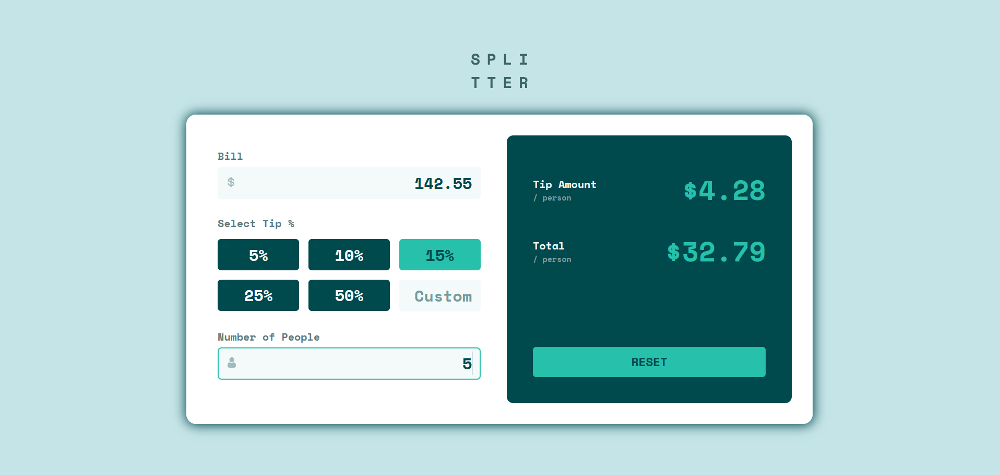

# Frontend Mentor - Tip calculator app solution

This is a solution to the [Tip calculator app challenge on Frontend Mentor](https://www.frontendmentor.io/challenges/tip-calculator-app-ugJNGbJUX). Frontend Mentor challenges help you improve your coding skills by building realistic projects.

## Table of contents

- [Overview](#overview)
  - [The challenge](#the-challenge)
  - [Screenshot](#screenshot)
  - [Links](#links)
- [My process](#my-process)
  - [Built with](#built-with)
  - [What I learned](#what-i-learned)
  - [Continued development](#continued-development)
  - [Useful resources](#useful-resources)
- [Author](#author)

## Overview

### The challenge

Users should be able to:

- View the optimal layout for the app depending on their device's screen size
- See hover states for all interactive elements on the page
- Calculate the correct tip and total cost of the bill per person

### Screenshot

### Links

- Solution URL: [https://github.com/by-yee/tip-calculator-app-main](https://github.com/by-yee/tip-calculator-app-main)
- Live Site URL: [https://by-yee.github.io/tip-calculator-app-main/](https://by-yee.github.io/tip-calculator-app-main/)

## My process

### Built with

- Semantic HTML5 markup
- CSS custom properties
- Flexbox
- CSS Grid
- Mobile-first workflow
- Javascript
- [React](https://reactjs.org/) - JS library

### What I learned

I'm currently learning react and this was my first project that I code with react instead of pure javascript.

Rather than using `Create React App` to build react environment, I tried to set up react environment manually by running fews npm command and modify the `webpack.config.js` & `.babelrc`, so that I have more understanding on what react actually used to performed development.

Since this project was using react, it's my first time to publish github page by installing github page dependency(run `npm i gh-pages`). After installing, update homepage from `package.json` to own github repository link, then run `npm run deploy`. This will compiled, build the public files and publish github page.

### Continued development

In this project, I am importing the `.css` file directly into `App.js`. For the future development, I would like to use react style component.

As a beginner of using react, I'm using `this.state` & `this.setState` to change the state object. Once familiar to react, I would like to try on using Hooks like `useState`, `useEffect`, etc...

### Useful resources

- [React Documentation](https://reactjs.org/docs/getting-started.html) - React documentation helps me a lot as a beginner

## Author

- Frontend Mentor - [@by-yee](https://www.frontendmentor.io/profile/by-yee)

